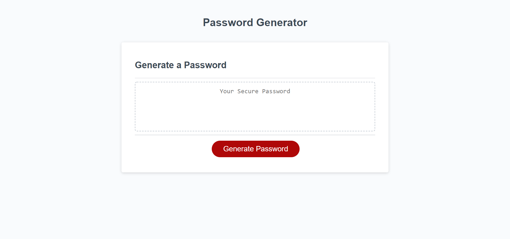
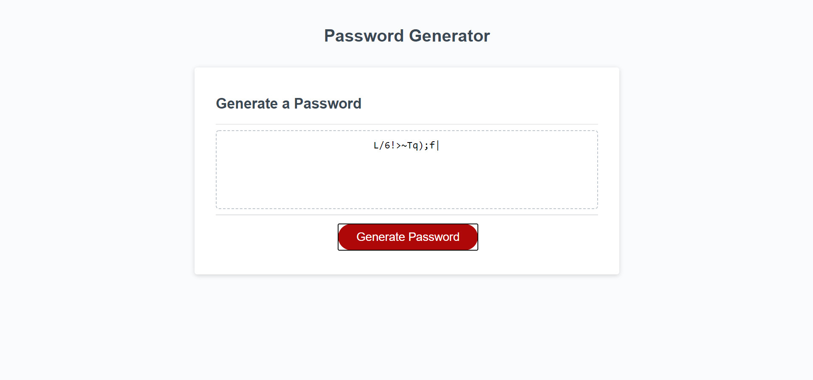

# Code-Generator
Javascript Code Generator

*Creating js code to allow the button to generate randomly, also utilizing html, css and jquery *User clicks button which sends prompts -prompts ask user password length -characters desired -informs them if they've entered correctly *Once these inputs are entered, if clauses are answered, and get entered to determine which characters to randomize and how many. *Returns with user password in text box

   https://eschiavoni2.github.io/Code-Generator/

*license: MIT

*Erika Zibelnik

email: e.m.zibelnik@gmail.com

Screen grabs:

